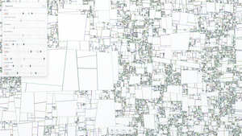

# GenSynth

GenSynth is a browser-based generative art scaffold for running pluggable algorithms with user-editable parameters.



## What is implemented

- Harness/engine for plugin algorithms (`init` + `run` API)
- Initial algorithm: minimal black random circles on a canvas
- Parameter limits that can be absolute or canvas-relative functions
- Tri-slider controls per parameter (`min`, `current`, `max`) with vertical handles
- Responsive canvas behavior on browser resize with full plugin re-init and default reset
- HUD controls with draggable vertical slider handles
- Start / Stop / Restart controls

## Plugin API

A plugin exports an object with:

```js
{
  id: "algorithm-id",
  name: "Display name",
  init: ({ width, height, ctx, limitContext }) => ({
    parameters: [
      {
        type: "range",
        key: "radius",
        label: "Radius",
        min: 0,
        max: 5000,
        default: 1000,
        step: 1,
      },
      {
        type: "range",
        key: "lineThickness",
        label: "Line Thickness",
        min: 0.5,
        max: 10,
        default: 1, // scalar default sets current; min/max stay at full limits
        step: 0.1,
      },
      {
        type: "range",
        key: "opacity",
        label: "Opacity",
        min: 0.01,
        max: 1,
        default: 0.5,
        step: 0.01,
      },
      {
        type: "bounds",
        key: "radiusBand",
        label: "Radius Band",
        min: 0,
        max: 1000,
        step: 1,
      },
    ],
  }),
  run: ({ ctx, width, height, frame, deltaMs, timestamp, params, clear }) => {
    const radiusBand = params.radiusBand; // { min, max }
    const lineThickness = params.lineThickness;
    const opacity = params.opacity;
    // draw here
  },
}
```

`limitContext` includes:

- `minDim`
- `maxDim`

Range default behavior:

- If `default` is omitted, `min/max` start at full limits and `current` starts at midpoint.
- If `default` is a number, `current` starts at that number while `min/max` start at full limits.
- If `default` is an object (`{ min, max, current }`), those values are used.

Bounds default behavior:

- If `default` is omitted, `min/max` start at full limits.
- If `default` is an object (`{ min, max }`), those values are used.

Runtime param behavior:

- Plugins receive only the `current` value for each range param.
- Plugins receive `{ min, max }` objects for each bounds param.

## Run locally

Use any static file server. Example:

```bash
python3 -m http.server 4173
```

Then open [http://localhost:4173](http://localhost:4173).

## License

MIT. See [LICENSE](./LICENSE).
